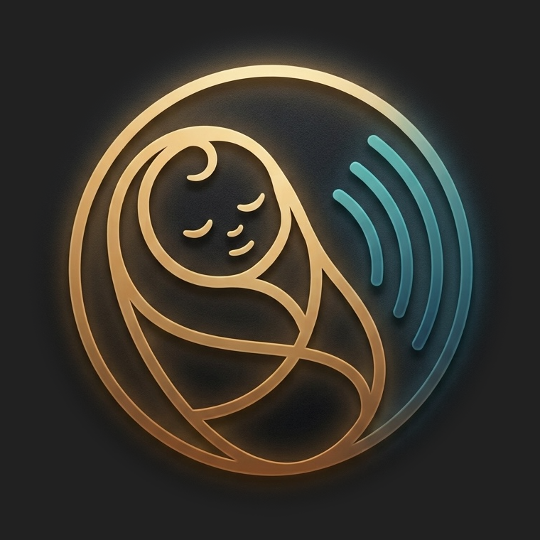

<p align="center"></p>

# Qundaq

[](https://github.com/qundaq/qundaq/actions/workflows/ci.yml)

**An offline-first, privacy-first baby tracker and sleep-sound player for twins (or any number of babies).**
Runs entirely on your phone as an installable web app. No accounts, no servers, no tracking — your data never leaves the device.

"Qundaq" is the Azerbaijani spelling of the Turkish _kundak_, a swaddling blanket.

[Türkçe açıklama aşağıda ↓](#türkçe)

---

## Status

🚧 **Early development.** The current version tracks babies, breastfeeding (with a left/right timer), bottles, sleep (with a timer), diapers with the stool color card, pumping, growth, temperature, medicines and health notes. The Log tab lists every entry by day and lets you correct or delete it; the Summary tab shows daily totals, a 7-day table and a growth chart. Backups (to the Files app, with a restore that previews every change) and a CSV export for your pediatrician are in. The Sounds tab plays four bundled recordings (white noise, an airplane cabin, a train, waves), one at a time, with a sleep timer and a volume safety cap. That completes the planned v1 feature set.

## Why

Parents of twins log a lot: feeds, sleeps, diapers — times two, often at 3 a.m. with one free hand. Most tracker apps need an account, sync to someone's cloud, or ship analytics SDKs. This one is built for a phone that lives in the diaper bag in airplane mode.

## Principles

1. **Your data never leaves your phone.** No backend, no account, no sync. Everything is stored locally in the browser (IndexedDB).
2. **No network activity after the first load.** The app is served entirely from its offline cache.
3. **No tracking of any kind.** No analytics, crash reporting, ads, external fonts, CDNs or remote images.
4. **No permissions.** No camera, microphone, location or notifications.
5. **Minimal, audited dependencies.** Runtime dependencies are limited to React, React DOM and Dexie.
6. **Verifiable.** Open source, built and deployed by CI straight from this repository. The principles above are enforced by automated tests, not just promised.

The full commitments, how each is enforced, and the few things we cannot control are in [MANIFESTO.md](MANIFESTO.md).

## Backups

Your entries live only on your phone, and iOS may delete a home-screen app's storage. Back up regularly; Home reminds you when the last backup is more than 7 days old.

- **Back up:** Settings → Backup → **Back up** → **Save to Files / share** → **Save to Files** → **On My iPhone**. This works in airplane mode. A file kept only in iCloud Drive cannot be opened in airplane mode.
- **Restore:** Settings → Backup → **Restore from a backup** (on a phone without babies, also on Home), pick the file, read the preview, then **Restore**. This merges: entries only on this phone are kept; for an entry on both sides the newer change wins, deletions included. After a wipe (a new phone, or the app deleted and added again) this brings everything back. **Replace everything** is also offered; it shows what it would delete and asks you to confirm.
- **CSV:** Settings → Backup → **Export as CSV** gives one spreadsheet per baby, for your pediatrician.
- The backup file is plain JSON and is **not encrypted**. The app never sends it anywhere: it goes only where you send it with the share sheet. If you pick iCloud Drive, Mail or WhatsApp, that service receives it.

## Planned features (v1)

- **Multiple babies**, each with their own name and color
- **Quick logging** built for one-handed use: sleep, breastfeeding (left/right timer), bottle, diapers, pumping, growth, temperature, medication, notes
- **Every entry and every stop can be undone for a few seconds.**
- **A baby is never asleep and feeding at once: starting one ends the other.**
- **Each baby's card logs for that baby: no baby picker in the sheet**
- **Timeline and daily summaries**, a 7-day overview and a growth chart
- **Stool color card** with a warning for pale/white/clay colors, an early sign of biliary atresia, one of the few things this app will ever nudge you about
- **Sleep sounds:** four bundled recordings (white noise, airplane cabin, train, waves), played one at a time, with a sleep timer and a volume safety cap
- **Backup & export:** JSON backup to the Files app, CSV export for your pediatrician
- **Dark, light and system themes**, and a night mode with a dim red/amber palette
- **Turkish and English**

## How it will work on your phone

1. Open https://qundaq.github.io/qundaq/ once in Safari while online.
2. Tap **Share → Add to Home Screen**.
3. Open it from the home screen once. When it says **"Ready for offline"**, you can switch to airplane mode for good.
4. To update, go online briefly and tap **Settings → Check for updates**.

## Tech

TypeScript · React · Vite · Dexie (IndexedDB) · Web Audio API · a hand-written service worker · Vitest · Playwright. Hosted as static files on GitHub Pages.

## Development

Requires Node 24+.

```bash
npm ci                                  # install (install scripts are disabled by .npmrc)
npm run dev                             # dev server (no service worker, no CSP)
npm run verify                          # typecheck, unit tests, build, license check, e2e
npx playwright install chromium webkit  # once, before the first e2e run
```

Before a release, run the [device checklist](docs/device-checklist.md) on a real iPhone.

## Sounds

The Sounds tab plays four bundled recordings: white noise, an airplane cabin, a train and waves. They play one at a time: tap a tile to start it, tap the playing tile to pause, tap another to switch (the two crossfade over about 2 seconds). The recordings are part of the app and are cached with it, so no audio is downloaded after the first load. Saved mixes from earlier versions still travel in backups but are no longer shown.

- **Sleep timer:** 15, 30 or 60 minutes (the default) or none. The sound fades out over the last 30 seconds and stops, also while the phone is locked. Pausing does not stop the countdown.
- **Locked screen:** the sound keeps playing with the screen locked and in airplane mode. It plays through the ring/silent switch, and it pauses other audio (a podcast) when it starts. After a call or an alarm while the phone is locked, iOS may keep the sound off until you open the app again; the app then shows "Resume".
- **Safety:** keep the phone out of the crib, at least 2 metres (about 7 feet) away, keep the volume as low as works, and prefer the timer to playing all night (Hugh et al., _Pediatrics_ 2014). Settings → **Volume safety cap** limits how loud the Sounds tab can go (default 50 %); raising it shows this advice, and raising it never makes a playing sound louder by itself. The phone's own volume buttons apply on top, and the app cannot read them.
- **Sources:** every sound is listed with its origin and licence in [`public/sounds/SOURCES.md`](public/sounds/SOURCES.md), also shown in the app under Settings → About → Sound sources. Recordings are CC0 or clearly labelled as AI-generated with the tool and date.

## Themes

Qundaq ships dark by default. Settings → Theme also offers light and a system option that follows iOS. Night mode is a separate switch that overrides either theme with a deliberately low-contrast red/amber palette on black, for feeds in the dark. Themes need iOS 16.2 or later (for `color-mix`); every currently supported browser meets that.

## Contributing

Contributions are welcome — see [CONTRIBUTING.md](CONTRIBUTING.md) for setup, checks and the project's hard rules (they are stricter than most). Everyone participating is expected to follow the [code of conduct](CODE_OF_CONDUCT.md). Security issues go through [SECURITY.md](SECURITY.md), not the issue tracker.

## Medical disclaimer

This app is a logbook, not medical advice. If you are worried about your baby, contact your pediatrician.

## License

MIT

---

## Türkçe

**İkizler (ya da herhangi sayıda bebek) için, internetsiz çalışan ve gizliliği öncelik alan bir bebek takip ve uyku sesi uygulaması.**
Telefonuna kurulan bir web uygulaması olarak çalışır. Hesap yok, sunucu yok, izleme yok. Verin telefondan asla çıkmaz.

"Qundaq", Türkçedeki _kundak_ kelimesinin Azerbaycan Türkçesindeki yazılışıdır.

**Durum:** 🚧 Geliştirmenin başında. Şu anki sürüm bebekleri, emzirmeyi (sol/sağ sayaçla), biberonu, uykuyu (sayaçla), kaka renk kartıyla bezi, sağımı, büyümeyi, ateşi, ilaçları ve sağlık notlarını takip ediyor. Günlük sekmesi kayıtları güne göre listeler, düzeltmenize ve silmenize izin verir; Özet sekmesi günlük toplamları, 7 günlük tabloyu ve büyüme grafiğini gösterir. Dosyalar uygulamasına yedek alma, her değişikliği önceden gösteren geri yükleme ve doktor için CSV çıktısı hazır. Sesler sekmesi dört hazır kaydı (beyaz gürültü, uçak kabini, tren, dalgalar) tek tek çalar; uyku zamanlayıcısı ve ses güvenlik sınırı var. Planlanan v1 özellikleri böylece tamamlandı.

**Yedekler:** Kayıtlar yalnızca telefonda durur ve iOS ana ekrana eklenen uygulamaların verisini silebilir. Düzenli yedek alın; son yedek 7 günden eskiyse Ana ekran hatırlatır.

- **Yedek al:** Ayarlar → Yedekleme → **Yedek al** → **Dosyalar'a kaydet / paylaş** → **Dosyalar'a Kaydet** → **iPhone'umda**. Uçak modunda çalışır. Yalnızca iCloud Drive'da duran bir dosya uçak modunda açılamaz.
- **Geri yükle:** Ayarlar → Yedekleme → **Yedekten geri yükle** (bebek eklenmemiş bir telefonda Ana ekranda da), dosyayı seçin, önizlemeye bakın, **Geri yükle**'ye dokunun. Bu birleştirir: yalnızca bu telefonda olan kayıtlar korunur; iki tarafta da olan bir kayıtta, silme dahil, daha yeni değişiklik geçerli olur. Telefon silindikten sonra (yeni telefon ya da uygulama silinip yeniden eklendiğinde) her şeyi geri getirir. **Tamamen değiştir** seçeneği de var; neyi sileceğini gösterir ve onay ister.
- **CSV:** Ayarlar → Yedekleme → **CSV olarak dışa aktar**, doktor için her bebeğe bir tablo verir.
- Yedek dosyası düz JSON'dur ve **şifrelenmez**. Uygulama dosyayı hiçbir yere göndermez; dosya yalnızca paylaş menüsünde sizin seçtiğiniz yere gider. iCloud Drive, Mail ya da WhatsApp'ı seçerseniz dosya o hizmete gider.

**Sesler:** Sesler sekmesi dört hazır kaydı çalar: beyaz gürültü, uçak kabini, tren ve dalgalar. Sesler tek tek çalınır: başlatmak için bir kutuya dokunun, çalan kutuya dokunursanız duraklar, başka bir kutuya dokunursanız ses yaklaşık 2 saniyede birinden diğerine geçer. Kayıtlar uygulamanın parçasıdır ve onunla birlikte saklanır; ilk yüklemeden sonra hiçbir ses indirilmez. Önceki sürümlerden kalan kayıtlı karışımlar yedeklerde yine taşınır ama artık gösterilmez.

- **Uyku zamanlayıcısı:** 15, 30 ya da 60 dakika (varsayılan) veya sınırsız. Ses son 30 saniyede kısılıp durur; ekran kilitliyken de. Duraklatmak geri sayımı durdurmaz.
- **Kilitli ekran:** Ses, ekran kilitliyken ve uçak modunda çalmaya devam eder. Sessiz anahtarı açıkken de çalar ve başladığında diğer sesleri (ör. bir podcast'i) duraklatır. Telefon kilitliyken gelen bir arama ya da alarmdan sonra iOS sesi uygulamayı yeniden açana kadar kapalı tutabilir; uygulama o zaman "Devam et" gösterir.
- **Güvenlik:** Telefonu bebeğin yatağına koymayın; en az 2 metre uzakta tutun, sesi olabildiğince kısık tutun ve bütün gece çalmak yerine zamanlayıcıyı kullanın (Hugh ve ark., _Pediatrics_ 2014). Ayarlar → **Ses güvenlik sınırı**, Sesler sekmesinin en fazla ne kadar yükselebileceğini belirler (varsayılan %50); sınırı yükseltmek bu uyarıyı gösterir ve çalan sesi kendiliğinden yükseltmez. Telefonun kendi ses tuşları bunun üstüne eklenir; uygulama onları okuyamaz.
- **Kaynaklar:** Her sesin kaynağı ve lisansı [`public/sounds/SOURCES.md`](public/sounds/SOURCES.md) dosyasında listelenir; uygulamada Ayarlar → Hakkında → Ses kaynakları altında da görünür. Kayıtlar CC0 lisanslıdır ya da hangi araçla ve ne zaman üretildiği belirtilerek yapay zekâyla üretildiği açıkça yazılır.

**Temalar:** Qundaq varsayılan olarak koyu temayla açılır. Ayarlar → Tema, açık temayı ve iOS'u izleyen sistem seçeneğini de sunar. Gece modu ayrı bir anahtardır; hangi tema seçili olursa olsun, karanlıkta besleme için siyah zemin üzerinde bilerek düşük kontrastlı bir kırmızı/kehribar palete geçer. Temalar için iOS 16.2 ya da üzeri gerekir (`color-mix` nedeniyle); şu an desteklenen her tarayıcı bu koşulu karşılar.

**İlkeler:**

- Veri yalnızca telefonda tutulur.
- İlk yüklemeden sonra uygulama hiçbir ağ isteği yapmaz.
- Analitik, izleme ya da reklam yoktur.
- Hiçbir izin istenmez.
- Bağımlılıklar asgari tutulur ve denetlenir.
- Kod açık kaynaktır. İlkeler otomatik testlerle zorunlu kılınır.

**Planlanan özellikler:**

- Birden çok bebek
- Tek elle hızlı kayıt: uyku, emzirme, biberon, bez, kaka rengi, sağım, büyüme, sağlık
- **Her kayıt ve durdurma birkaç saniye içinde geri alınabilir.**
- **Bir bebek aynı anda hem uyuyor hem emiyor görünmez: biri başlayınca diğeri biter.**
- Her bebeğin kartı yalnızca o bebek için kayıt açar; sayfada bebek seçimi yok
- Günlük, özet ve büyüme grafiği
- Uyarılı kaka renk kartı
- Uyku sesleri (dört kayıt) ve zamanlayıcı
- JSON yedek ve CSV çıktısı
- Koyu, açık ve sistem temaları; kırmızı/kehribar tonlu gece modu
- Türkçe ve İngilizce

**Tıbbi uyarı:** Bu uygulama bir kayıt defteridir, tıbbi tavsiye değildir. Endişen varsa çocuk doktoruna danış.
